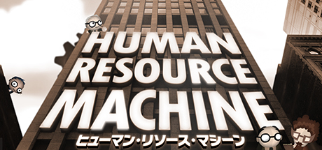
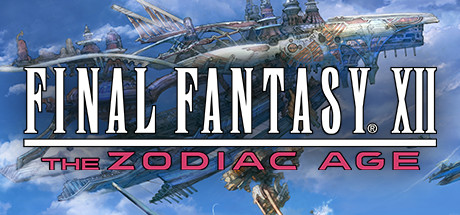
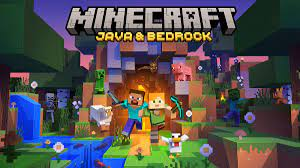
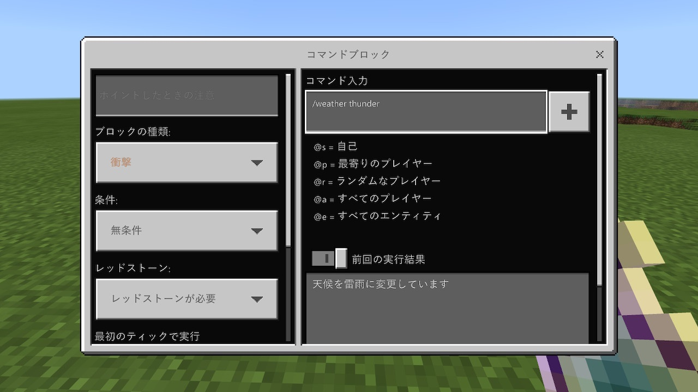

# プログラミングが取り入れられているゲーム

## ゲーム紹介

## Human Resource Machine

ヒューマンリソースマシーン

https://store-jp.nintendo.com/list/software/70010000000753.html

### 特徴

- パズルゲームのようにステージを進んでいくタイプ
- ステージ毎の課題を満たす動作をプログラミングで解いていく
- 狭い領域を使って情報をやりくりする
- 正解は一つじゃない(最短コードや動作の速いコードなど)
- 0かどうか、マイナスかどうかの分岐など使って処理を分岐させていく

### ゲームの様子

- 左側から流れてきた数字を、課題に合うようにいじって右側のレーンに流していく

<video controls src="https://user-images.githubusercontent.com/11056457/222556994-98ffa2b6-95e9-46b5-b528-08f9d9a53b36.mp4
" muted="false"></video>

- さらに難易度の上がった7 Billion Humansもある

https://store-jp.nintendo.com/list/software/70010000014082.html

## Autonauts

オートノーツ
https://store-jp.nintendo.com/list/software/70010000054071.html

### 特徴

- ロボットをプログラミングして動かす
- ロボットで自動化しながら開拓をするゲーム
- 主に農業や建築をロボットを使って自動化していく
- ある程度進めると文明が上がり、作れるものや出来ることが増えていく

### ゲームの様子

- 一例として伐採の様子

<video controls src="https://user-images.githubusercontent.com/11056457/222589627-8a2ca342-44fb-4690-a193-56d944ebc803.mp4" muted="false"></video>

- こんな感じのプログラムになっている

## FINAL FANTASY XII

FINAL FANTASY XII
https://store-jp.nintendo.com/list/software/70010000009747.html

### 特徴

- 有名タイトル
- 古いゲームだが、綺麗･快適になったバージョンを遊べる
- バトルシステムはいつもはコマンド選択だが今作はガラッとかわっている

### ガンビットシステム

- キャラクター毎に行動パターンを設定する
- オートで戦ってくれる
- 正しく組んでないと棒立ちになってしまうことも…

## 番外編(簡単な紹介)

### Minecraft

https://store-jp.nintendo.com/list/software/7001000000965.html

- めちゃくちゃ有名タイトルなので外した
- レッドストーンという回路を組んで自動ドアや簡単な仕掛けを作ることができる
- ゲーム内でコマンドブロックというスクリプトを書ける機能がある
- Mod製作も人気

学校で取り入れられるケースも

https://www.watch.impress.co.jp/kodomo_it/news/1287773.html

### ナビつき！ つくってわかる はじめてゲームプログラミング

https://store-jp.nintendo.com/list/software/70010000041266.html

- 任天堂のゲームを作れるソフト
- ゲームというよりもかなり本格的に作成できる
- Switch用なのでSwitchのコントローラや機能を活用したものが作れる
- 中にゲームを遊んでみてから、同じものを作ってみる流れ
- いろいろなノードを置いて、つなげて実装を進める
  - Unityなどのゲームエンジンて使われているノードプログラミングで進めることが出来る

## まとめ

### プログラミングの入門にあたっての難しさ

- 目標をきめることや規模感
- 言語によっては黒い画面とのにらめっこが続く

### ゲームだと

- 視覚情報的に豪華
- 段階的に目標が常に出てくる

といったことからモチベーションが維持しやすいのではないか？
と感じていて、こういったものをとっかかりにするのは良いのではないかと思いました。

### その他

- 全部Switchで遊ぶことが出来るタイトルに絞ってみました
- はじめてゲームプログラミング以外はPC版もあります
