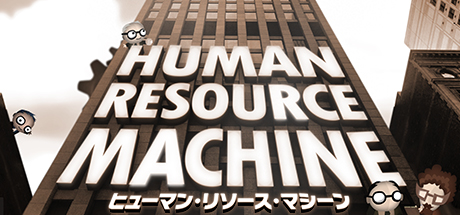
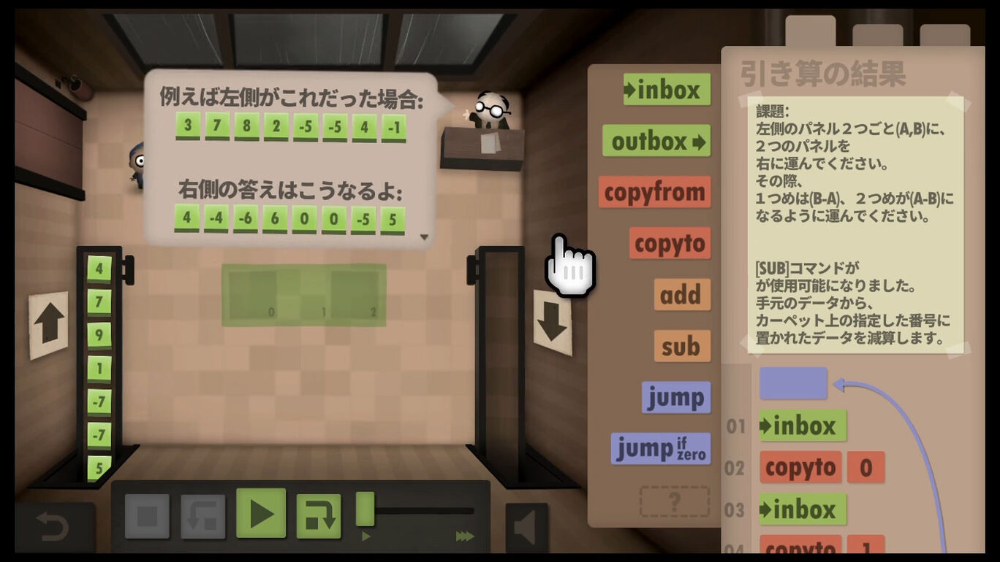
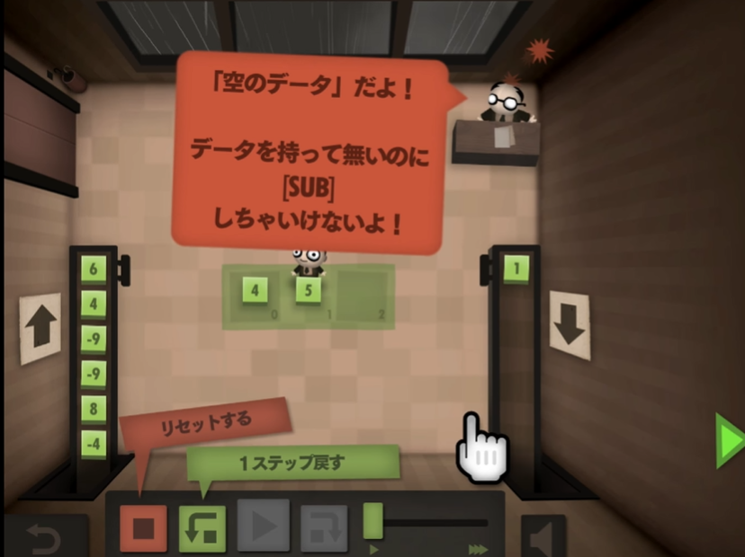
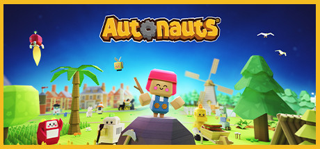
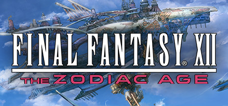
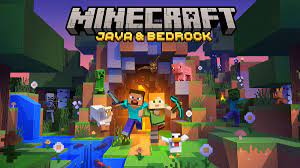
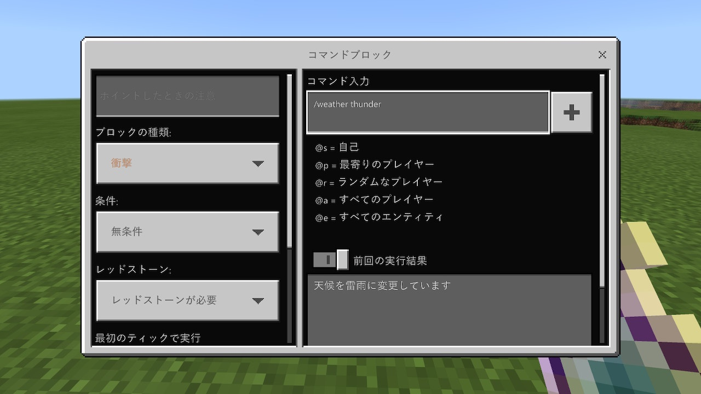

# プログラミングが取り入れられているゲーム

## ゲーム紹介

## Human Resource Machine

ヒューマンリソースマシーン

### 特徴

- パズルゲームのようにステージを進んでいくタイプ
- ステージ毎の課題を満たす動作をプログラミングで解いていく
- 狭い領域を使って情報をやりくりする
- 正解は一つじゃない(最短コードや動作の速いコードなど)
- だんだん難易度が上がっていく

### ゲームの様子

## Autonauts

オートノーツ

### 特徴

- ビジュアルプログラミングができる
- ロボットをプログラミングして動かす
- ロボットでオートメーション化しながら開拓をするゲーム
- 農業や建築をロボットを使って自動化していく
- ある程度進めると作れるものや出来ることが増えていく

### ゲームの様子

## FINAL FANTASY XII

### 特徴

- 有名タイトル
- 古いゲームだが、綺麗･快適になったバージョンを遊べる
- バトルシステムはいつもはコマンド選択だが…

## 番外編(簡単な紹介)

### Minecraft

- めちゃくちゃ有名タイトルなので外しました
- レッドストーンという回路を組んで自動ドアや簡単な仕掛けを作ることができる
- ゲーム内でコマンドブロックというスクリプトを書ける機能がある
- Mod製作も人気

### ナビつき！ つくってわかる はじめてゲームプログラミング

- 任天堂のゲームを作れるソフト
- ゲームというよりもかなり本格的に作成できる
- Switch用なのでSwitchのコントローラや機能を活用したものが作れる
- 中にゲームを遊んでみてから、同じものを作ってみる流れ
- いろいろなノードを置いて、つなげて実装を進める
  - Unityなどのゲームエンジンて使われているノードプログラミングで進めることが出来る

## まとめ

### プログラミングの入門にあたってのむずかしさ

- 目標をきめるのが難しい
- 言語によっては黒い画面とのにらめっこが続く

### ゲームだと

- 視覚情報的に豪華
- 段階的に目標が常に出てくる

といったことからモチベーションが維持しやすいのではないか？
と感じていて、こういったものをとっかかりにするのは良いのではないかと思いました。

### その他

- 全部Switchで遊ぶことが出来るタイトルに絞ってみました
- はじめてゲームプログラミング以外はPC版もあります
