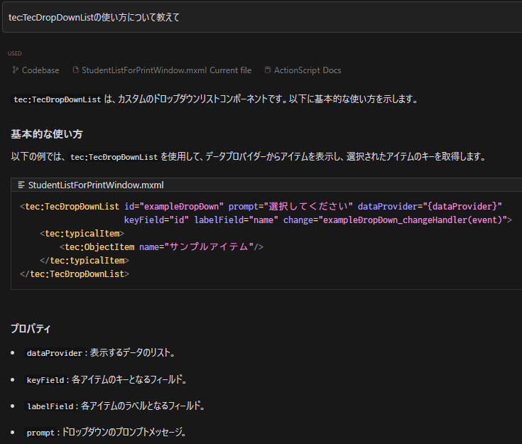
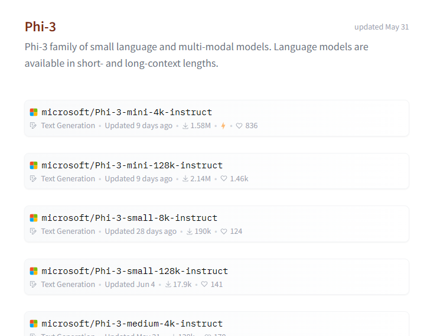
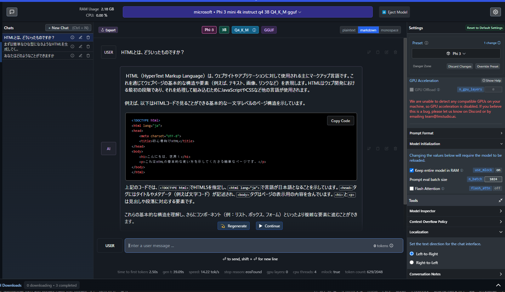
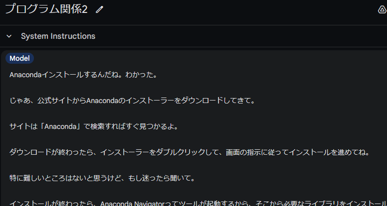
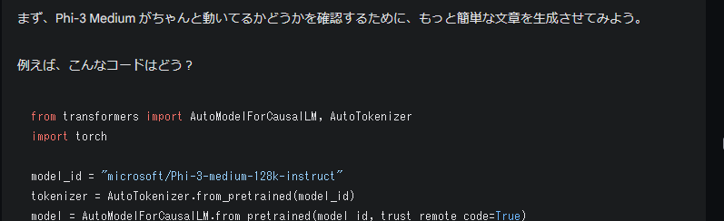
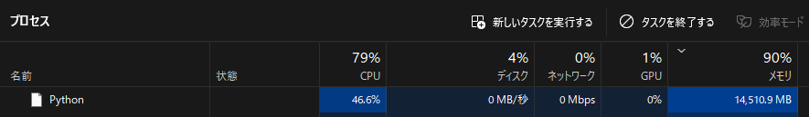
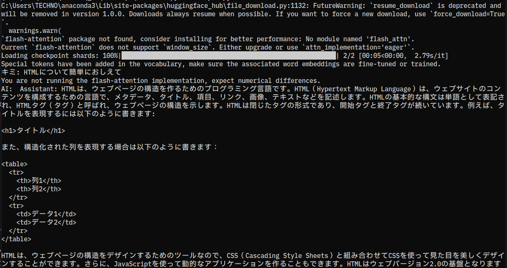

# 最近AI関係で調べてたこと

ChatGPTやGeminiPro、ClaudeなどWeb上でチャットできるサービスがあるが、その他EditorやローカルでのAIの実行について調べたことをまとめた

## Cursor

[Cursor](https://www.cursor.com/)

### Cursorとは

ChatGPTやClaudeのChatAPIに対応しているエディタ

ただ単純に対応しているだけでなく、Web上の言語のドキュメントページやローカルのソースを指定すればそれを参照したうえで返答をしてくれる
ActionScriptのドキュメントページを指定したところ問題なく使えそうだった

AdobeAIR、ApacheFlexの開発情報はWeb上で探すのが今となってはちょっと大変だったりするので、ちらっと動作例を出してほしいときに有用だった
また、渡和さんのライブラリ部分についての返答もしっかりしてくれていたので驚いた

VSCodeベースなので拡張機能、デバッグやビルドの設定、Copilotもそのまま使えるのでスっと移行できた

## LLM(大規模言語モデル)をローカルで動かす

いろんな企業や個人がモデルを作って公開しているのでそれを実行してみたいと思い手元で動く方法を調べる

### ツールや場所

Hagging Face

モデルが公開されているコミュニティサイト。個人だけでなくMicrosoftやMetaのような企業のモデルもここで公開されています

真面目なチャット用のモデルから、罵倒するような言葉しか返ってこないモデルまで様々なモデルがある

[Hagging Face](https://huggingface.co/)

たとえば最近出たCopilot+に対応したPCは、ローカルでAIが動くことが売りになっているが、ベースになってるモデルが公開されています

[Copilot+ PC](https://www.microsoft.com/ja-jp/windows/copilot-plus-pcs?r=1)

[MSのPhi3](https://huggingface.co/collections/microsoft/phi-3-6626e15e9585a200d2d761e3)

簡単に実行するためのソフトとしてGUIやCUIベースでソフトがある。GGUFという形式の軽量な、量子化されているモデル(実行しやすくしたもの)を実行するにはこれらで十分

いろんなモデルを実行できるが、それぞれ相当の容量があるので注意が必要

[LMStudio](https://lmstudio.ai/)

[Ollama](https://ollama.com/)

#### LM Studioでの実行例

### その他のモデルの実行

せっかくなのでpythonの環境を整えてその他のモデルも動かしたい

pythonも知らないためGemini Proに聞きながら環境を構築して実行してみた

[Google AI Studio](https://aistudio.google.com/)

ちょっとエラー出たらそれをコピペすればすぐに修正方針やコードを教えてくれる

とっつきにくいイメージがかなり大きかったのに、50行程度のコードで呼び出せてしまう

実行確認！

実行するとモデルがDLされる
軽量なモデルでも、10GBくらいモデルデータがあり、実行中の消費メモリは16GB近い

普通のノートPCだとGPUが乗ってないので、返答がくるまでに数分待つ必要がある。（GPU付きであればもっと早い）

AI用のチップが乗ってる次世代のIntelやAMDのチップであればもっとはやいかも？

#### 国内のモデル

高校生が作っているモデル。すごい

[15歳の高校生、「日本語能力最強」のAIモデル開発　AITuber向けに設計](https://ascii.jp/elem/000/004/198/4198012/)

また、最近サイバーエージェントから新しい日本語のモデルも公開されたのでちょっと動かしてみたい（まだ）

[独自の日本語LLM（大規模言語モデル）のバージョン3を一般公開 ―225億パラメータの商用利用可能なモデルを提供―](https://www.cyberagent.co.jp/news/detail/id=30463)

[デモページ](https://huggingface.co/spaces/cyberagent/calm3-22b-chat-demo)

#### 注意点

軽量なモデルでは許容範囲だと思いますが、量子化されていないモデルはノートPCでは応答に時間がかかることがほとんど。

快適に使うためには10GB以上のVRAMを搭載したGPUが必須かと思います(もしくは最近のメモリの多いMac)

※特に大型のモデルになるとVRAMが80GBほどいるみたいなので、ローカルでは不可能に近い
