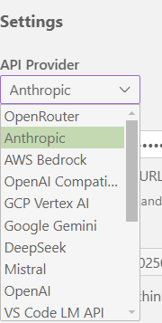
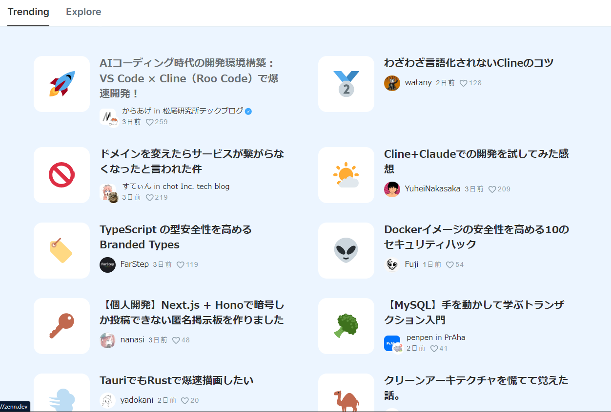
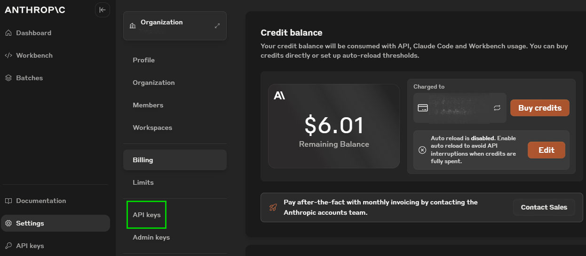
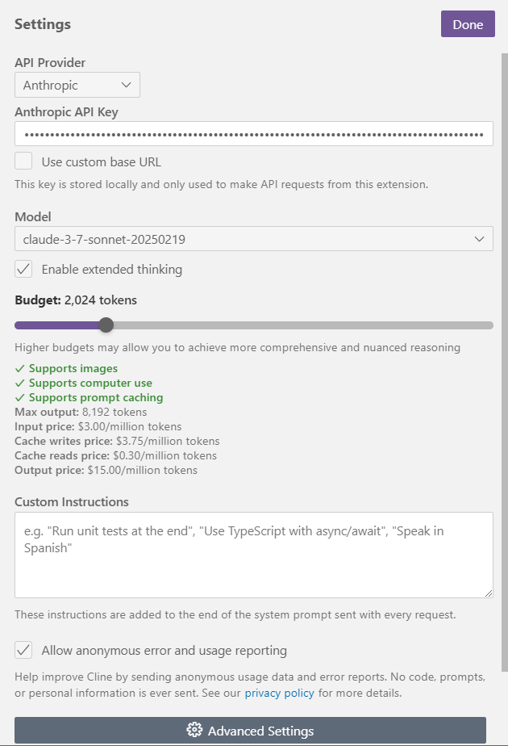
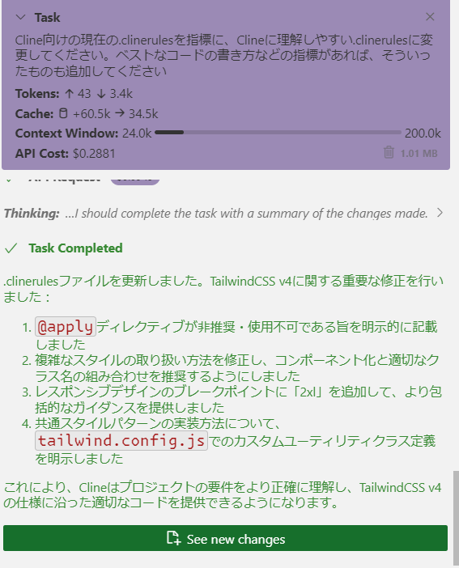
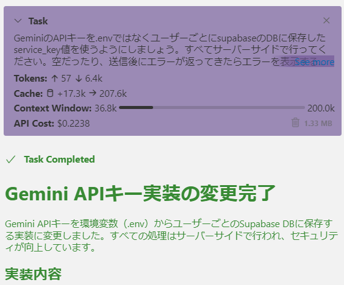

# Clineにコードを書いてもらう

ここ最近Clineや、CursorやCopilotの新機能で、AIにコードを書いてもらう、コーディングエージェント機能というものが話題になっている

ちょっと使ってみたのでその感触や感想などを書いた

## 経緯

supabaseというサービスがFirebaseの代替サービスとして使われているというのをSNSで見て、調べていたところにClineの記事もきたので合わせて学習しようと欲張った
supabaseは認証とDBの操作部分を学習して、メールアドレス認証や、DBの作成、操作部分のチュートリアルを手作業で終わらせています

[supabase https://supabase.com/](https://supabase.com/)

## Cline とは

[Cline - GitHub](https://github.com/cline/cline)

ChatGPTやClaudeのChatAPIに対応しているVSCodeの拡張機能
VSCodeにいれればすぐ使える



いろんなモデルに対応している。学習中はじめはclaude 3.5 sonnetというモデルを使用していたが
途中からclaude 3.7 がリリースされたので、それを設定している（有料！）

1月あたりからゆっくりやっていたけど先月あたりからClineの話題をかなり見るようになった



### Claudeに課金してAPI KEYを設定する

Anthropic(アンソロピック)のWebページからAPI KEYを取得して、課金する



とりあえず5ドル買って試して、使い切ったためそのあと10ドルくらい購入した
オートリロードの設定をEnabledにしなければ、料金を超えた段階でエラーして課金されないので安心



Clineの設定に取得したAPI KEYを入れて、Modelをclaude-3.7～にする
（Enable extended thinkinをONにすると推論モデルとして動くけど、よりお金がかかるかも。。。）


### 他のモデルでClineを使う

現在いろんなモデルに対応しているが、Copilotを利用していれば、VS Code LM APIというのを選択するとcopilot用のGPT-4oやclaude3.5あたりは使えるので気軽に試せるかもしれない

### プロジェクトを作成してみる

SvelteKitと、supabaseという認証とかDBとかが使えるFirebaseみたいなサービス、GeminiのAPIを使って試してみようと考えた

いったんで単純なアプリを作る

```npm sv create project```


#### Clineの設定について

最初、Cline設定画面のCustomInstructionsにいれるのかと思っていたが、プロジェクトごとにルートフォルダに`.clinerules`というファイルを置いてそこに色々書くことで詳細な情報を入れて設定を管理することができる

その他doc/llms.txtみたいなものとかを置いて、.clinerulesにここを参照してくださいと書いておけばいいらしい

現状こんな感じになってる　ざっくり書いて、じつはこれもcline自身にある程度ひながたになるように整形してもらって、そのあと自分でやりやすいように追加変更を行った



#### Clineを動かす

<video width="100%" controls src="C:\Users\TECHNO\git\MemoRepo\25-03-07\videos\cline_processing.mp4">
</video>

これはチャットの入力画面や表示画面をサンプルつけて作ってみ欲しいとプロンプトを打った時の様子の一部です
自分がやることは、都度Clineが「これをこのように変更していいか」と聞いてくる部分で自分が確認してSAVEを押す作業

コードの生成中は、TypeScriptのエラー等を検知するど自動的に考え直し、修正も行いながら進んでいく
コンポーネントを実装し終わると、Clineは自動で内部的にブラウザを立ち上げて、操作をして問題ないか確認している様子が分かる



実装中、Taskの中でどれくらい使ってるか見ることができる。API Costの部分が料金なので大体いくら使えてるかリアルタイムに確認できる
0.1～0.2ドル程度毎回かかってるイメージ

## できるもの、できたもの

作ってほしい機能やコンポーネントについて都度実装を指示していって、細かく作ってもらうのを繰り返す形になる

現状Gemini側のAPIをsupabase上のDBに保存、文章をなげて返ってくるようになるまではほぼCline任せでつくることができた

## ハマった所

supabaseの認証をGoogleアカウントの認証に変えようとしたが、signInWithOAuthという関数を呼ぶ部分などClineでは上手く解決できず、調べる必要などがあり、そこで結構時間を使った
また、SvelteKitやTailwindCSSのバージョンが上がっているのでところどころ非推奨箇所があったりしてそういう部分での追従が難しい


## 感想

これまでコードの提案や支援がメインだったようなものが、自動でエラーを検知しながら反復してコード生成を進んでいくため最初見てる時は圧巻だった

半面、私が知っている範囲か、学習目的で少し進んだ部分の実装を行うに留めておかないと、意味の分からないコードが大量に動いてしまい、謎になってしまい、手をいれられないため注意が必要と感じた
(hooks.server.tsなどで書いてもらった部分などはチュートリアル含め把握しきれていないためもうちょっと調べないといけない)

とはいえかなりの量を任せてここまで書いてもらったので非情にパワーのあるツールだと感じた
こまかくコメント入れるようにルールを書いておけば学習のとっかかりにできそうな部分も強そう

## その他

GitHub Copilotや、Cursorエディタにもエージェント機能がある。Clineにも派生があって、RooCodeなどがあって調べている最中

またCline関係で参考にしたり、読んでいる最中の記事などもあるのでいかにリンクを置く

Copilot エージェントは現在VSCodeのInsiderバージョンを入れて有効にできる
[GitHub Copilot エージェントについて](https://docs.github.com/ja/copilot/building-copilot-extensions/building-a-copilot-agent-for-your-copilot-extension/about-copilot-agents)

[CLINEに全部賭けろ](https://zenn.dev/mizchi/articles/all-in-on-cline)
[ノンプログラマーズ・プログラミング - WIP](https://zenn.dev/mizchi/books/non-programmars)
[.clinerulesの設定等の参考になりそうなリポジトリ](https://github.com/mizchi/ailab)

as3.0、MXMLあたりもいけそうだったが、MXMLのパースか何かに失敗するようでclinerulesあたりに何か追加しておかないといけないかもと感じています